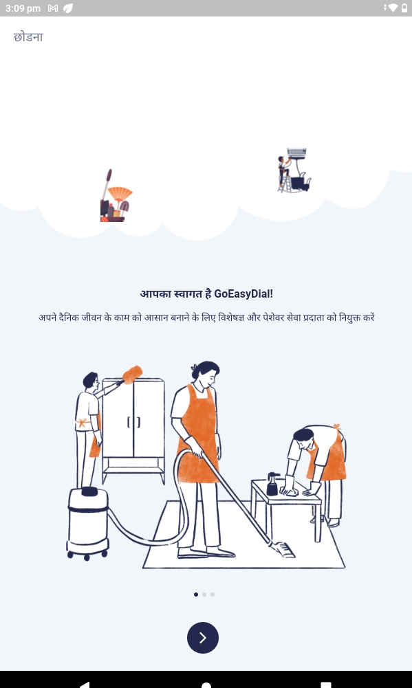
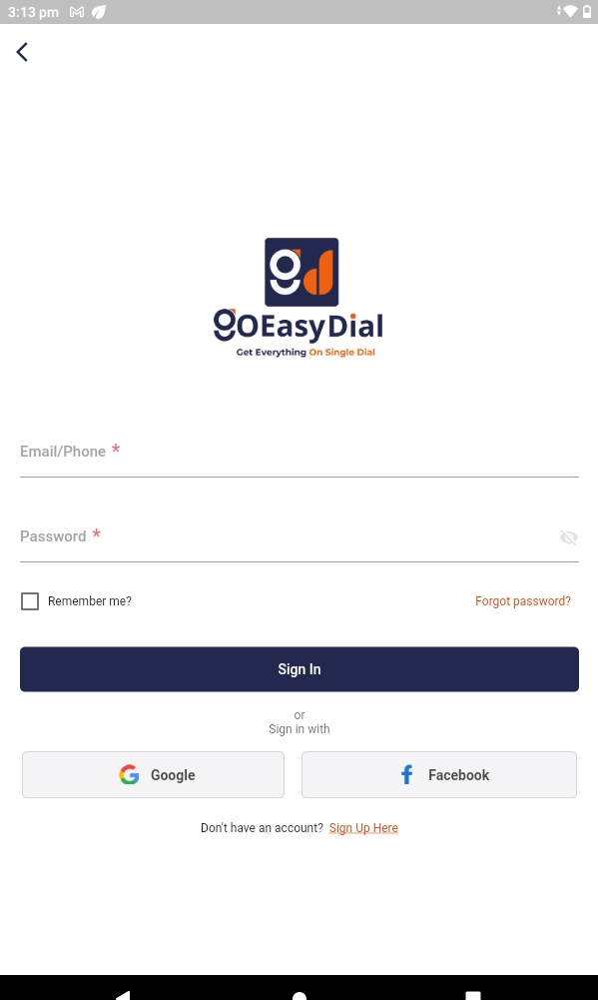

# 🚀 App Name

Simplify your daily life with ease!  
Hire top-rated experts and professional service providers, all in just a few taps.  
Create personalized service requests, select your preferred provider, and schedule services at your convenience.

From household chores to specialized tasks — find the perfect help whenever you need it.  
Enjoy a smoother, more relaxing life with the smartest way to get things done.

**Your daily life, made effortless. 🚀**

---

# 📱 Features

- Create custom service requests
- Choose trusted service providers
- Schedule services for a later time
- Track and manage your service history
- Enjoy a hassle-free experience!

# 📸 App Screenshots
### Language Screen

### Onboard Screen

### Login Screen

### Home Dashboard

### Select Location

### Bookings 

### Services 

---

this is read me file !

issue list:
https://docs.google.com/document/d/1Py51u0vlNzTWXsUJGpe1Ghbw4kRyVmN1z3Ii5VpW7xc/edit

https://docs.google.com/document/d/1ESNtMD2Qwimtwv0pPbcpLEq72J8uN1uN0iVUdL9fQ7M/edit

FLUTTER SDK: 3.27.3

flutterwave test card:
Visa Card 3DS authentication 2	4242424242424242	812	3310	01/31	12345

This might be overkill, but this is the best way I know to perform the cleanest pod install and ensure that you have no lingering pod cache issues or misconfigured Xcode settings:

cd ios
rm -rf Podfile.lock
rm -rf Pods
rm -rf pubspec.lock
pod repo update
pod cache clean --all
pod deintegrate
pod setup
pod install --repo-update

flutter build apk --target-platform android-arm,android-arm64,android-x64 --split-per-abi

flutter run -d chrome --web-hostname localhost --web-port 5000